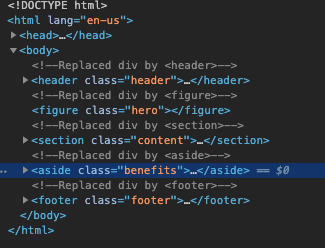

# HW1-Code-Refactor

## Task
In the given scenario , a marketing agency said he wants a codebase that follows accessibility standards, so that their own site is optimized for search engines.

## Finished Requirements

Semantic HTML elements,
Logical structure,
Image alt attribute,
Heading in sequential order,
Concise title

## Details in Code
Changes are commented in the index/html [Index](./Develop/index.html),
Screenshots ,

